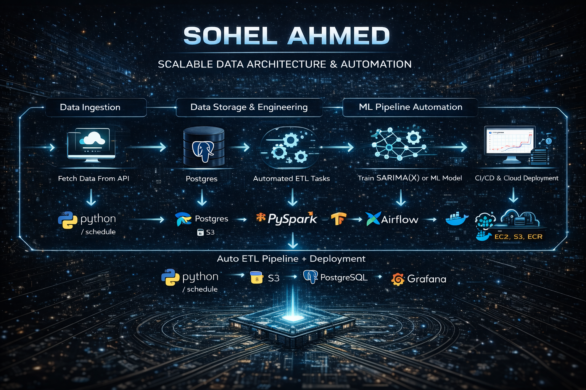

  

# Hi 👋, I'm Sohel Ahmed
🎯 Data Scientist | ML Engineer | Scalable ML Systems
📍 Michigan, USA  

## 🚀 About Me
Building production-scale ML systems from data ingestion to real-time deployment.
I am a Lead Statistician &  Data Scientist at the University of Michigan with **8+ years of experience** building **production-scale machine learning systems** across healthcare, NLP, and large-scale data platforms.

💡 I specialize in:
- Designing **end-to-end ML systems** (data → model → deployment)
- Building **large-scale pipelines (10M–100M+ records)** using PySpark
- Developing **low-latency ML APIs (<200–300 ms)** using FastAPI
- Deploying scalable systems using **AWS + Docker + CI/CD**

---

## 🧠 Featured Projects

### 🔹 Clinical NLP & RAG System (Spark + ClinicalBERT + LLMs)
- Processed **130M+ clinical notes** using distributed Spark pipelines  
- Built **retrieval-augmented generation (RAG)** system with FAISS  
- Achieved **~1.3–4.0 sec latency** with optimized inference pipeline  
- Designed scalable ML system for healthcare AI applications  

---

### 🔹 NYC Spark Lakehouse ML Pipeline
- Engineered pipeline processing **100M+ NYC taxi records**  
- Reduced processing time by **60% using distributed computing**  
- Built end-to-end system with **Airflow, FastAPI, PostgreSQL**  
- Deployed using **Docker + AWS + CI/CD pipelines**  

---

---

### 🔹 YOLOv8 Vision AI System (Object Detection + OCR)
- Real-time detection system using **YOLOv8 + EasyOCR**  
- Built FastAPI service with **low-latency inference (<300 ms)**  
- Implemented monitoring using **Prometheus + Grafana**  
- Deployed on AWS with production-ready architecture  

---

## ⚙️ Tech Stack

**Languages:** Python, SQL, R, SAS  
**ML/AI:** XGBoost, PyTorch, TensorFlow, LLMs, RAG, ClinicalBERT  
**Big Data:** PySpark, Hadoop, Distributed Systems  
**Backend:** FastAPI, REST APIs  
**MLOps:** Docker, MLflow, GitHub Actions, CI/CD  
**Cloud:** AWS (EC2, S3, ECR)  
**Monitoring:** Prometheus, Grafana  

---

## 📊 What I Focus On

- Production-grade ML systems  
- Scalable data pipelines  
- Cloud-based AI solutions  
- Real-world industrial and data-driven applications  

---

## 📫 Connect With Me

- 🔗 LinkedIn: https://www.linkedin.com/in/sohelcu06/
- 💻 GitHub: https://github.com/sohel10  

---
