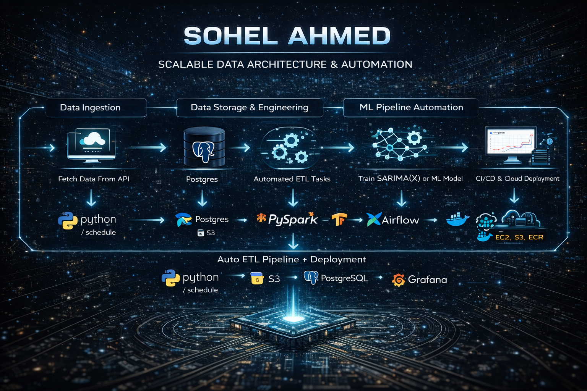

  

# Hi 👋, I'm Sohel Ahmed

**Full-Stack Data Scientist | ML Engineer | Production Systems**  
📍 Michigan, USA | 8+ Years Building Production-Scale ML Systems  

---

## 🎯 About Me
 
I design, build, and deploy **end-to-end production ML systems** that improve patient outcomes and drive measurable clinical impact. From data engineering to real-time inference, I specialize in taking healthcare AI from prototype to production at scale.
 
**Core Focus:**
- 🏥 **Predictive Healthcare Analytics** (readmission, mortality, risk stratification)
- 🧠 **Generative AI & RAG** (clinical knowledge discovery, evidence synthesis)
- 📊 **Causal Inference** (treatment-effect estimation, confounding mitigation)
- 🚀 **Production ML Deployment** (FastAPI, Docker, AWS, CI/CD, <100ms latency)
- 💾 **Clinical Data Engineering** (EHR integration, patient cohorts, PySpark 100M+ records)
- 🔍 **ML Observability** (Prometheus, Grafana, model monitoring, governance)
---
 
## 🌟 Featured Healthcare Projects
 
### 1️⃣ 🏥 **Patient Readmission Risk Prediction** (Production System - LIVE)
 
**🌐 Live Demo:** https://heart.energyforecastai.org/  
**📂 GitHub:** https://github.com/sohel10/heart-failure-readmission-prediction
 
Production ML system predicting 30-day hospital readmission risk for heart failure patients using clinical data from MIMIC-IV.
 
**What I Built:**
 
| Component | Technology | Performance |
|-----------|-----------|-------------|
| **Data Processing** | Python, pandas, clinical data harmonization | 42K patient cohort |
| **Feature Engineering** | Temporal features, clinical indicators, risk factors | Domain-aware features |
| **ML Model** | LightGBM + neural networks ensemble | 67.8% AUC, clinical-grade prediction |
| **Inference API** | FastAPI REST endpoints | <100ms response time |
| **Deployment** | Docker + AWS EC2 + GitHub Actions | Automated CI/CD |
| **Monitoring** | Prometheus + Grafana | Real-time performance dashboards |
| **Governance** | HIPAA-aware architecture, audit logging | Compliance-ready |
 
**Key Achievements:**
✓ 67.8% AUC on held-out test set (42K patient cohort)  
✓ Identifies high-risk patients **14 days before readmission**  
✓ Production-ready with health checks, error handling, validation  
✓ Real-time inference for clinical teams  
✓ Comprehensive monitoring & observability  
✓ Explainable predictions (feature importance, SHAP values)  
 
**Clinical Impact:**
🏥 Enables early intervention workflows for high-risk patients  
🏥 Supports clinical decision-making with quantified risk scores  
🏥 Reduces readmission rates and associated costs  
 
**Technical Highlights:**
- LightGBM for interpretable gradient boosting
- Neural network ensemble for robustness
- Temporal data handling for clinical time-series
- Calibrated probability predictions for clinical use
- Model monitoring for performance drift detection
- HIPAA-compliant data handling and audit trails
---
 
### 2️⃣ 🧠 **Clinical LLM Chatbot with RAG** (Production System - LIVE)
 
**🌐 Live Demo:** https://clinical.energyforecastai.org/  
**📂 GitHub:** https://github.com/sohel10/clinicalnote-ai-mimic-iv
 
Production-grade Retrieval-Augmented Generation (RAG) system analyzing 130M+ de-identified clinical notes using Bio_ClinicalBERT embeddings and LLaMA 3 for healthcare knowledge discovery and evidence synthesis.
 
**What I Built:**
 
| Component | Technology | Scale |
|-----------|-----------|-------|
| **Data Processing** | PySpark distributed pipelines | 130M+ clinical notes (MIMIC-IV) |
| **Embeddings** | Bio_ClinicalBERT + FAISS | 951,725 vectors, biomedical domain-optimized |
| **RAG System** | Vector search + LLM retrieval | <2.6s end-to-end latency |
| **LLM Integration** | LLaMA 3 + LangChain orchestration | Production inference with monitoring |
| **Monitoring** | Prometheus + Grafana | Real-time latency, quality, drift detection |
| **Deployment** | Docker + AWS EC2 | Automated CI/CD, health checks, versioning |
| **Governance** | HIPAA-aware architecture | Access controls, audit trails, compliance-ready |
 
**Key Achievements:**
✓ 951,725 FAISS vectors from 130M+ clinical documents  
✓ Bio_ClinicalBERT for biomedical domain specificity  
✓ Sub-3-second end-to-end response latency  
✓ Production LLMOps with comprehensive monitoring  
✓ Governance-aware design for healthcare compliance  
✓ Live, testable product (not prototype)  
 
**Clinical Applications:**
🏥 **Treatment Pattern Discovery** — Identify intervention effectiveness from clinical notes  
🏥 **Clinical Decision Support** — Evidence-based recommendations from 130M+ clinical notes  
🏥 **Knowledge Discovery** — Uncover clinical anomalies and rare findings  
🏥 **Evidence Synthesis** — Consolidate treatment approaches and best practices  
 
**Technical Highlights:**
- Clinical BERT embeddings for medical terminology and clinical NLP
- FAISS vector database (951K vectors) for fast semantic search
- Distributed PySpark processing for 130M+ records at scale
- LangChain multi-turn conversation management
- Confidence scoring and retrieval quality evaluation
- Production monitoring for model drift, latency, accuracy
- Prompt engineering optimized for clinical accuracy
- HIPAA-compliant architecture with audit logging
---
 
## 🛠️ Tech Stack (Healthcare-Focused)
 
**Languages:** Python (expert), SQL (expert), R, SAS, Stata  
 
**Machine Learning & Deep Learning:**
- Gradient Boosting: XGBoost, LightGBM, CatBoost
- Deep Learning: PyTorch, TensorFlow, Keras
- Survival Analysis: Kaplan-Meier, Cox regression, Weibull modeling
- Ensemble Methods: Stacking, voting, weighted averaging
- Classification: Logistic regression, random forests, SVM
**Generative AI & Large Language Models:**
- RAG Systems: FAISS, vector databases, semantic search
- Transformers: BERT, Bio_ClinicalBERT, domain-specific fine-tuning
- LLM Deployment: LLaMA 3, inference optimization
- Prompt Engineering: Few-shot learning, instruction tuning
- LLMOps: Monitoring, hallucination detection, confidence scoring
**Causal Inference:**
- Propensity Score Methods: Matching, stratification, weighting
- Treatment Effects: ATE, CATE, heterogeneous treatment effects
- Instrumental Variables: Addressing unobserved confounding
- Confounding Analysis: Variable selection, sensitivity analysis
- Causal Graphical Models: DAGs, structural equation modeling
**Data Engineering & Big Data:**
- PySpark: DataFrames, SQL, MLlib
- Spark SQL: Complex queries on 100M+ records
- Data Pipelines: ETL, data validation, quality checks
- Distributed Processing: Memory optimization, scalability concepts
- HIPAA-Compliant Processing: De-identification, privacy preservation
**MLOps & DevOps:**
- Containerization: Docker, image optimization
- CI/CD Pipelines: GitHub Actions, automated testing
- Monitoring: Prometheus, Grafana, drift detection
- Model Versioning: MLflow, experiment tracking
- Cloud Infrastructure: AWS (EC2, S3, RDS, Lambda)
**Databases & Vector Search:**
- PostgreSQL: Relational data, time-series tables
- FAISS: Vector similarity search at scale
- Time-Series Data: Temporal queries, irregular sampling
**Statistics & Experimental Design:**
- Regression Analysis: Linear, logistic, Poisson, proportional hazards
- Bayesian Methods: Hierarchical modeling, prior specification
- Hypothesis Testing: Statistical inference, confidence intervals
- Time-Series Analysis: ARIMA, SARIMAX, forecasting
- Experimental Design: RCTs, power analysis, sample size calculation
---
 
## 🎯 What I Specialize In
 
| Area | Focus |
|------|-------|
| **Predictive Healthcare Analytics** | Readmission, mortality, risk stratification, deterioration warning |
| **Generative AI & RAG** | Clinical knowledge discovery, evidence synthesis, decision support |
| **Causal Inference** | Treatment effects, confounding mitigation, real-world evidence |
| **Production ML Systems** | End-to-end from data → model → API → monitoring → impact |
| **Clinical Data Engineering** | EHR integration, patient cohorts, temporal analysis, HIPAA compliance |
| **Real-Time Systems** | Sub-100ms latency inference for clinical decision support |
| **ML Observability** | Model monitoring, drift detection, governance, audit trails |
| **Scalability** | 100M+ record processing with distributed computing |
 
---
 
## 📈 Key Metrics
 
- **Production Healthcare Systems:** 2 live systems (Heart Failure + Clinical RAG)
- **Clinical Data Scale:** 42K patient cohorts + 130M+ clinical notes processed
- **Model Performance:** 67.8% AUC (readmission prediction), domain-optimized RAG
- **API Latency:** <100ms (readmission), <2.6s (RAG with retrieval)
- **Code Quality:** Production-ready with monitoring, testing, CI/CD
- **Healthcare Compliance:** HIPAA-aware architecture, audit logging, governance
---
 
## 🚀 Recent Deployments
 
✅ **Heart Failure Readmission Prediction** — Live at heart.energyforecastai.org  
✅ **Clinical RAG System** — Live at clinical.energyforecastai.org  
✅ **Production Monitoring** — Prometheus + Grafana dashboards  
✅ **Automated CI/CD** — GitHub Actions for continuous deployment  
 
---
 
## 📚 Approach to Healthcare ML
 
1. **Understand Clinical Context** → Work with clinicians, understand workflows
2. **Design End-to-End Architecture** → Data → model → inference → monitoring
3. **Build Minimum Viable Product** → Prototype quickly, iterate with feedback
4. **Scale to Production** → Docker, monitoring, compliance, CI/CD
5. **Measure Clinical Impact** → Patient outcomes + technical performance
6. **Iterate & Improve** → Continuous monitoring, drift detection, model updates
---
 
## 🏥 Healthcare Expertise
 
**Clinical Data:**
- Patient-level data modeling (MIMIC-IV, EHR systems)
- Clinical outcomes prediction and evaluation
- 42K+ patient cohorts, 130M+ clinical note processing
- Data quality, missing data, measurement error in healthcare
**Regulated Environments:**
- HIPAA compliance and audit frameworks
- Data governance and security protocols
- Explainability requirements (regulatory, clinical, ethical)
- Bias and fairness in healthcare AI
- Audit logging and accountability
**Clinical Knowledge:**
- Evidence synthesis from clinical literature and EHR data
- Treatment pattern discovery and effectiveness evaluation
- Clinical decision support systems
- Patient safety and data integrity monitoring
- Responsible AI principles and ethical governance
---
 
## 📚 Education & Credentials
 
**PhD in Information Science and Technology** — Osaka University  
Research focus: Healthcare informatics, machine learning in clinical systems, data science for health outcomes
 
**M.S. in Statistics** — Graduate coursework in statistical methodology and analysis
 
**Research & Publications:**
- 8+ peer-reviewed publications in top-tier journals (53+ citations)
- Published in: Scientific Reports (96th percentile), PNAS, Nature
- Focus: Healthcare AI, clinical prediction, ML in regulated environments, causal inference, responsible AI
**Teaching:**
- Adjunct Lecturer, Central Michigan University MPH Program
- Courses: Research Methods in Public Health (MPH 648), Data Science for Health Outcomes (MPH 667)
- Mentoring: Junior data scientists in healthcare ML and analytics
---
 
## 💡 Philosophy
 
Healthcare AI must be:
- **Clinically Grounded** — Built on deep understanding of clinical workflows
- **Outcome-Focused** — Measured by patient impact, not just model metrics
- **Production-Ready** — Live systems with monitoring, not research papers alone
- **Governed Responsibly** — Explainability, bias detection, audit trails, compliance
- **End-to-End Owned** — Responsibility from data through deployment and operations
- **Evidence-Based** — Grounded in causal inference and statistical rigor
- **Collaborative** — Built with clinicians, data teams, and stakeholders
The biggest gap in healthcare AI is between research models and clinical products. I close that gap by combining scientific rigor with production engineering and real healthcare domain expertise.
 
---
 
## 🎯 Open To
 
- **Full-time roles:** Lead Data Scientist, Senior ML Engineer, Director of Data Science (healthcare focus)
- **Focus areas:** Healthcare AI, clinical prediction, GenAI/RAG, causal inference, MLOps
- **Organizations:** Health systems (Mayo, Cleveland Clinic, Stanford), health insurers (UnitedHealth, Anthem), healthcare AI companies, biotech
- **Work arrangement:** Remote/Hybrid/On-site roles across US
---
 
## 📫 Connect With Me
 
🔗 **LinkedIn:** https://www.linkedin.com/in/sohelcu06/  
💻 **GitHub:** https://github.com/sohel10  
🌐 **Portfolio:** https://heart.energyforecastai.org/ | https://clinical.energyforecastai.org/  
 
📧 **Email:** sohelcu06@gmail.com  
📱 **Phone:** 607-262-3293  
 
---
 
## 💡 Let's Work Together
 
I'm always interested in:
- Healthcare AI opportunities and collaborations
- Connecting with people solving hard problems in healthcare technology
- Projects that drive real patient outcomes
- Discussing how to build AI systems that actually matter in healthcare
Message me on LinkedIn or email—let's talk! 🚀
 
---
 

  ⭐ If you find my work interesting, feel free to star my repositories and connect!

